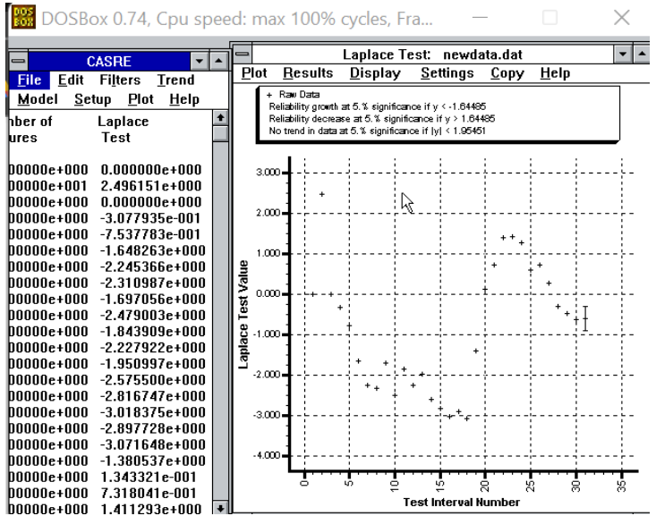
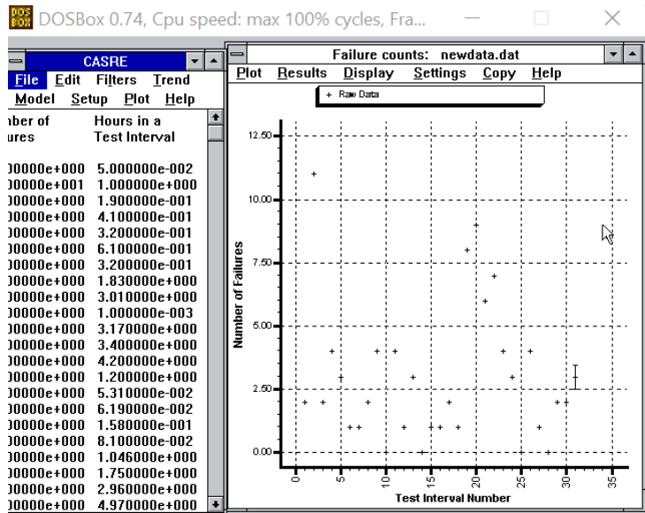
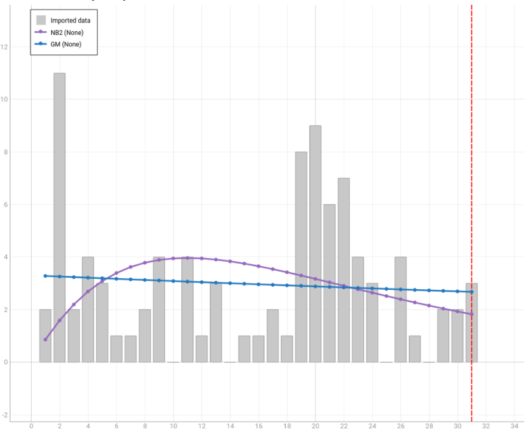
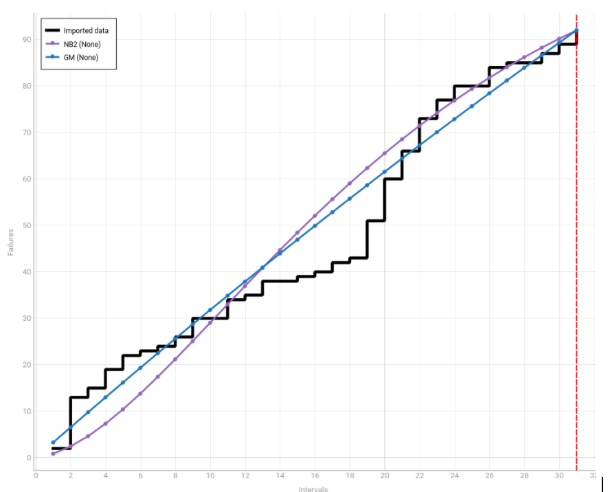
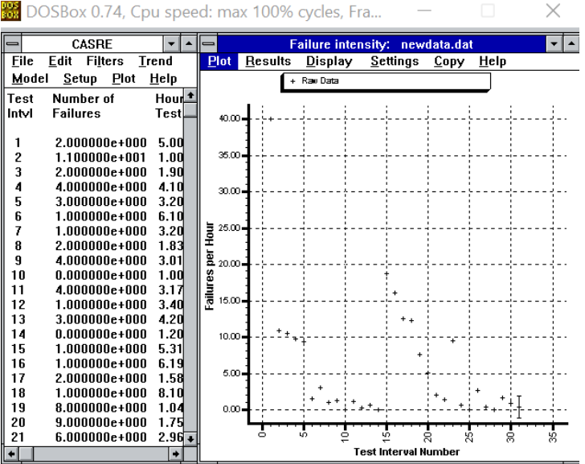
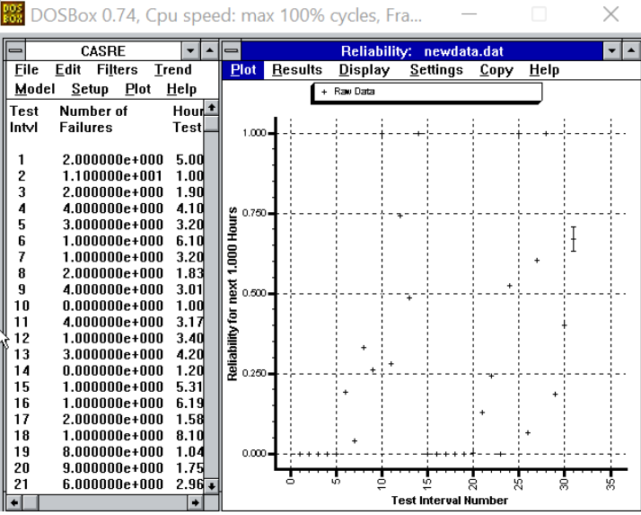
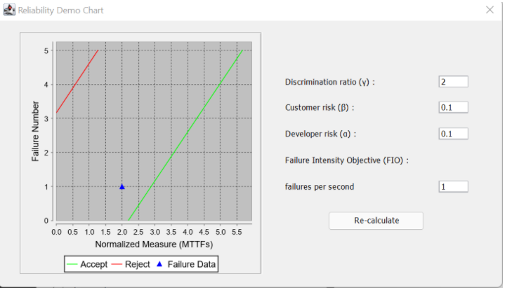
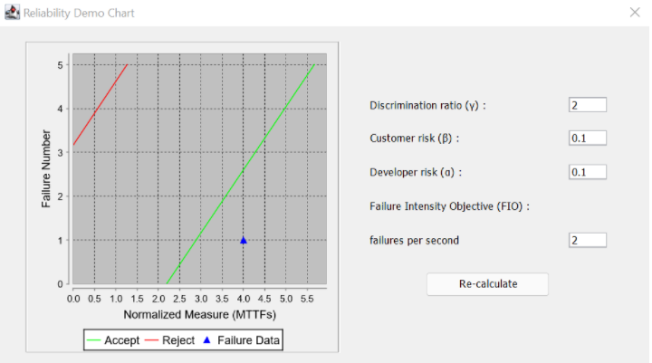
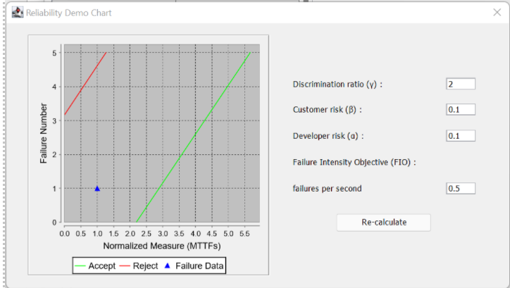

**SENG 637 - Dependability and Reliability of Software Systems**  

   

Lab Report #5 

   

Software Reliability Assessment 

   

Instructor: Dr. Behrouz Far ([far@ucalgary.ca](mailto:far@ucalgary.ca))  

   

Teaching Assistants:  

Yousef Mehrdad Bibalan ([yousef.mehrdadbibala@ucalgary.ca](mailto:yousef.mehrdadbibala@ucalgary.ca))   

Department of Electrical and Computer Engineering  

University of Calgary  

  

| Group number | 34                  |
| ------------ | ------------------- |
| Member 1     | Quinn Cooper        |
| Member 2     | Akram Ansari        |
| Member 3     | Mahsa Malek         |
| Member 4     | John Matthews Sarno |

  

  

  

  

  

  

  

 

 

 

 

 

 

 

 

 

 

 

 

|      |      |
| ---- | ---- |
|      |      |
|      |      |

**Introduction** 

In software engineering, it is crucial that an application does not simply work as designed but also consistently and reliably. Hence, there is a dire need to be able to predict when a specific software function is bound to fail. There is no other effective way of doing this but using tools that can accurately characterize defects to improve reliability of a software and perform corrective actions as needed. 

In this assignment, analysis of integration test data was performed by using two different reliability assessment tools: 

\1. Reliability growth testing 

\2. Reliability assessment using Reliability Demonstration Chart (RDC). 

In our opinion, the main goal of this assignment is to give an opportunity for students to gain experience on evaluating the reliability of hypothetical system by considering its failure data collected during integration testing. 

For the first part of the assignment (reliability growth testing), we have selected C-SFRAT but would eventually realize that CASRE was more useful with the provided failure data. 

**Assessment Using Reliability Growth Testing** 

To be able to gain hands-on experience on assessing the reliability first we have to install the reliability growth assessment tools, like SRTAT or CASRE. Then it would help us to create plots of failure rate and reliability. This would allow us to measure the failure rate. The format of data had been changed to be compatible for CASRE, then imported to be able to be applied Laplace test on it. 

 

**Result of model comparison (selecting top two models)** 

This analysis was done using the C-SFRAT python tool. We ran the estimation using various models and came up with these 2 models to give the most accurate results. Although, none of the models were giving exact results, the selected models were giving acceptable results).  

We selected these two models based on the model accuracy. 

1. Geometric 
   The line in blue shows the results from the geometric model. As we can notice from the graph that this model gives the best result of the two in the starting 10 and last 10 data values. 

1. Negative Binomial (Order 2) 
   The line in purple shows the prediction using the Negative binomial model. This model is better suited for the last 10-time intervals. Even more than the geometric model.  

Both these models fail to give satisfactory results for the mid region for time = 10 to 20. The failure intensity graph shows that the graph failure intensity stabilizes in the mid region of the tested time intervals. Both the models fail to predict accurate values in this region. 

**Failure Intensity Graph** 

**Cumulative Failure Graph** 

 

Result of range analysis (an explanation of which part of data is good for proceeding with the analysis) 

Based on the input data, we assumed the Laplacian threshold to be 2 which means that tests after time interval greater than or equal to 20 are good for proceeding with the analysis (which covers 33% of the input data) 

Plots for failure rate and reliability of the SUT for the test data provided 

**Failure Rate Plot:** 

**Reliability Plot:** 

A discussion on decision making given a target failure rate 

​	The target failure rate often means that decision will have to be made around it. These decisions can often feel arbitrary in nature, thus making those decision difficult. We decided our target failure rate would have to be a mean average of the results from the dataset. We calculated that value which came out to be 3 failures per hour. 

A discussion on the advantages and disadvantages of reliability growth analysis 

​	The models provided each gave a unique perspective on the dataset, we found them most useful for see if our target failure rate could be achieved. 

Some advantages are: 

- Determining the speed at which requirements can be achieved 
- Seeing how reliability improves over time 
- Giving background information allowing for greater test planning. 

The only disadvantage to doing reliability growth analysis is having to collect the data in the first place. 

**Assessment Using Reliability Demonstration Chart** 

3 plots for MTTFmin, twice and half of it for your test data 

Evaluation and justification of how you decide the MTTFmin 

When we finished the evaluation of the graphs, we had decided on the MTTFmin based on the most useful data available. This established a precedent where we then decided the MTTFmin as the result of such. We visually identified and verified the closest Mean Time to Failure for which the System gets accepted after testing the system acceptance for various MTTF values. 

A discussion on the advantages and disadvantages of RDC 

We found that RDC worked best when: 

- Failures were known 
- Failure data was limited 

RDC analysis deliver project in minimum time and cost for reliability and availability. 

When RDC was not optimal: 

- When not looking for the trend of the system. 

It could be mentioned that RDC cannot be used for the exact quantitative value for reliability. 

**Comparison of Results** 

After performing the tests on the two reliability assessment tools, we realized that there is a difference on how these tools portray the target failure rates. Since RDC depicted the target failure rates greater than the failure intensity objective of the system, it then passed the reliability testing. However, the case is different with CASRE. Almost all data points can be useful depending on how strict you can be with the Laplace test. For instance, if the last couple points are used, the system will not be as reliable enough as compared to RDC. The same is true when the reliability chart provided by CASRE was observed: instead of having a steady increasing trend, the graph instead almost shoot up. In summary, the system failed the reliability test performed using CASRE and passed when RDC is used. 

**Discussion on Similarity and Differences of the Two Techniques** 

In our observation, The Reliability Demonstration Chart seemed to have provided more straightforward information since there existed a boundary where you can determine whether a specific instance of test passed or failed, which simply did not exist for Reliability Growth Testing (RGT). However, by using RGT, we were able to predict the time interval where a test would potentially fail given the failure data. This is possible since the tool used can provide us with a target failure rate, a defined estimation, and a set of useful information. 

**How the teamwork/effort was divided and managed** 

The tasks were distributed equally amongst the team members. Although, we still held frequent group meetings to collaborate and share ideas since this assignment had been a bit more challenging. 

**Difficulties encountered, challenges overcome, and lessons learned** 

The main struggle the team had to endure and overcome was understanding how the software provided works, from SRTAT and CASRE to RDC. The assignment progressed as we understood the functionality of the given tools and explored through each of them. The team learned that to fully grasp the proper operation of these tools, the reliability models should be reviewed first and that the “A covariate software tool to guide test activity allocation” paper provided in the “read me” file had been extremely helpful throughout the process. 

**Comments/feedback on the lab itself** 

 

First, the purpose of the assignment was clearly stated in the manual. However, a lot of information was not provided to properly conduct the assignment. Different tools were given for reliability growth testing, yet only CASRE was the only tool worked effectively. 

 
